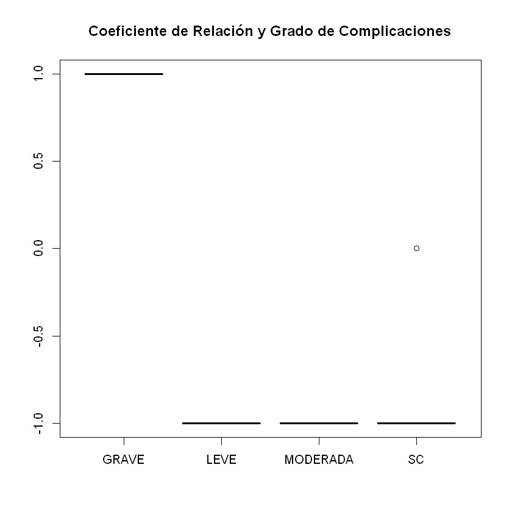
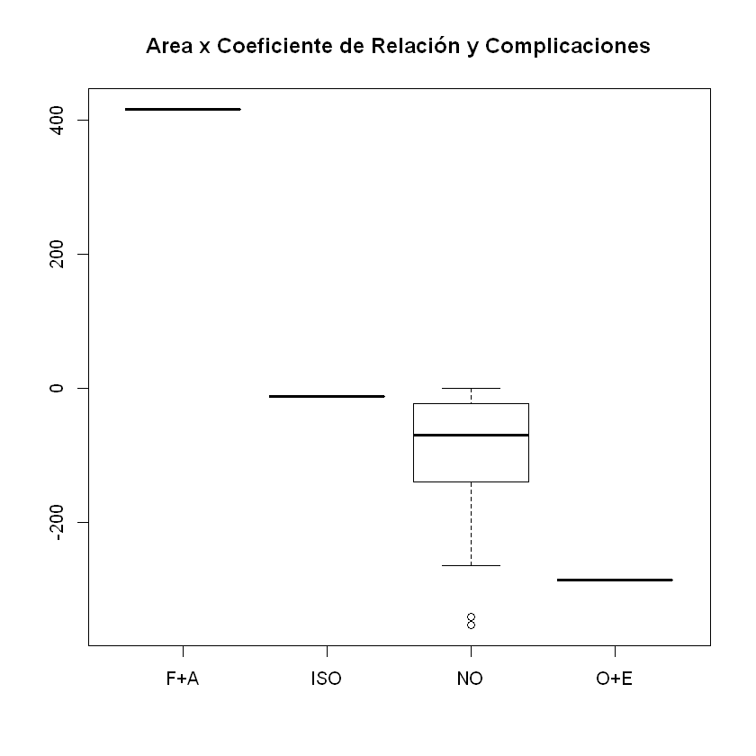
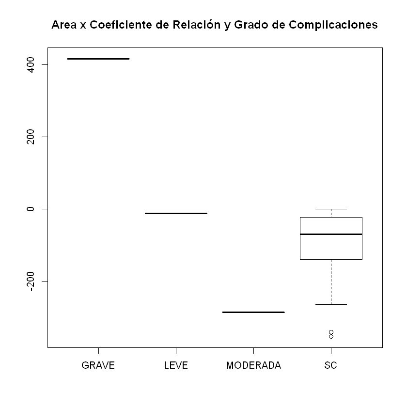

```R
install.packages("RcmdrMisc")
install.packages("googlesheets")
install.packages("dplyr")
```


```R
library(googlesheets)
suppressMessages(library(dplyr))
my_sheets <- gs_ls()
gs_ls("DDW")
gap <- gs_title("DDW")
gs_ws_ls(gap)
```


```R
gap %>% gs_read(ws = 3)
```

    Accessing worksheet titled 'CCX'.
    Parsed with column specification:
    cols(
      .default = col_double(),
      Sexo = col_character(),
      Edad = col_integer(),
      Procedimiento = col_character(),
      DX = col_character(),
      Laparoscopia = col_character(),
      ComplicacionesCX = col_character(),
      Reintervención = col_character(),
      GCCX = col_character(),
      CPCR = col_character(),
      CLeu = col_character(),
      CCX = col_character(),
      IP = col_character()
    )
    See spec(...) for full column specifications.
    


<table>
<thead><tr><th scope=col>Sexo</th><th scope=col>Edad</th><th scope=col>Procedimiento</th><th scope=col>DX</th><th scope=col>Laparoscopia</th><th scope=col>ComplicacionesCX</th><th scope=col>Reintervención</th><th scope=col>GCCX</th><th scope=col>LeuD3</th><th scope=col>NeutD3</th><th scope=col>...</th><th scope=col>VCMD5</th><th scope=col>HbD5</th><th scope=col>PCRD5</th><th scope=col>DPCR</th><th scope=col>DLeu</th><th scope=col>CPCR</th><th scope=col>CLeu</th><th scope=col>CCX</th><th scope=col>IPCRLeu</th><th scope=col>IP</th></tr></thead>
<tbody>
	<tr><td>M                                                    </td><td>67                                                   </td><td>Derivaciones intestinales                            </td><td>Ca Colon                                             </td><td>no                                                   </td><td>no                                                   </td><td>no                                                   </td><td>sc                                                   </td><td>10.30                                                </td><td> 7.11                                                </td><td>...                                                  </td><td>71.3                                                 </td><td>10.10                                                </td><td> 56.96                                               </td><td>  -2.96                                              </td><td> -1.29                                               </td><td>DISMINUYE                                            </td><td>DISMINUYE                                            </td><td>NO                                                   </td><td> 2.72110217                                          </td><td>POSITIVO                                             </td></tr>
	<tr><td>M                                                    </td><td>75                                                   </td><td>Gastrectomía Total                                   </td><td>Ca gástrico                                          </td><td>no                                                   </td><td>no                                                   </td><td>no                                                   </td><td>sc                                                   </td><td>14.30                                                </td><td>12.20                                                </td><td>...                                                  </td><td>97.7                                                 </td><td>10.90                                                </td><td>192.04                                               </td><td>  55.10                                              </td><td> -3.20                                               </td><td>AUMENTO                                              </td><td>DISMINUYE                                            </td><td>NO                                                   </td><td>-0.65333956                                          </td><td>NEGATIVO                                             </td></tr>
	<tr><td>M                                                    </td><td>50                                                   </td><td>Derivaciones intestinales                            </td><td>Ca Colon enteritis                                   </td><td>no                                                   </td><td>obstrucción, evisceracion                            </td><td>si                                                   </td><td>moderada                                             </td><td>10.80                                                </td><td> 9.98                                                </td><td>...                                                  </td><td>92.7                                                 </td><td> 9.85                                                </td><td>206.85                                               </td><td> -34.23                                              </td><td> -3.48                                               </td><td>DISMINUYE                                            </td><td>DISMINUYE                                            </td><td>SI                                                   </td><td> 2.86058077                                          </td><td>POSITIVO                                             </td></tr>
	<tr><td>M                                                    </td><td>60                                                   </td><td>Gastrectomía Esplenectomía Colectomia                </td><td>Ca gástrico                                          </td><td>no                                                   </td><td>no                                                   </td><td>no                                                   </td><td>sc                                                   </td><td>22.40                                                </td><td>20.70                                                </td><td>...                                                  </td><td>85.2                                                 </td><td>12.00                                                </td><td>195.20                                               </td><td> -91.10                                              </td><td> -3.30                                               </td><td>DISMINUYE                                            </td><td>DISMINUYE                                            </td><td>NO                                                   </td><td>-0.07104261                                          </td><td>NEGATIVO                                             </td></tr>
	<tr><td>F                                                    </td><td>58                                                   </td><td>Gastrectomía subtotal                                </td><td>Ca gástrico                                          </td><td>no                                                   </td><td>no                                                   </td><td>no                                                   </td><td>sc                                                   </td><td>13.00                                                </td><td>10.50                                                </td><td>...                                                  </td><td>88.9                                                 </td><td> 9.66                                                </td><td>319.50                                               </td><td> -76.71                                              </td><td> -3.44                                               </td><td>DISMINUYE                                            </td><td>DISMINUYE                                            </td><td>NO                                                   </td><td> 1.35383965                                          </td><td>NEGATIVO                                             </td></tr>
	<tr><td>F                                                    </td><td>53                                                   </td><td>Sigmoidectomía + corrección fístula                  </td><td>enf divertículo                                      </td><td>si                                                   </td><td>no                                                   </td><td>no                                                   </td><td>sc                                                   </td><td> 9.57                                                </td><td> 6.86                                                </td><td>...                                                  </td><td>88.3                                                 </td><td>12.10                                                </td><td> 23.94                                               </td><td> -80.87                                              </td><td> -2.71                                               </td><td>DISMINUYE                                            </td><td>DISMINUYE                                            </td><td>NO                                                   </td><td>-3.14921621                                          </td><td>NEGATIVO                                             </td></tr>
	<tr><td>M                                                    </td><td>78                                                   </td><td>Derivación gástrica                                  </td><td>Ca gástrico                                          </td><td>no                                                   </td><td>no                                                   </td><td>no                                                   </td><td>sc                                                   </td><td>18.70                                                </td><td>15.70                                                </td><td>...                                                  </td><td>71.0                                                 </td><td> 8.11                                                </td><td>117.73                                               </td><td> -15.59                                              </td><td>  1.40                                               </td><td>DISMINUYE                                            </td><td>AUMENTO                                              </td><td>NO                                                   </td><td>-0.65319165                                          </td><td>NEGATIVO                                             </td></tr>
	<tr><td>M                                                    </td><td>67                                                   </td><td>Gastrectomía Total Esofagectomía distal Esplenectomía</td><td>Ca gástrico                                          </td><td>no                                                   </td><td>no                                                   </td><td>no                                                   </td><td>sc                                                   </td><td>19.80                                                </td><td>17.70                                                </td><td>...                                                  </td><td>85.2                                                 </td><td> 9.24                                                </td><td> 59.92                                               </td><td>-144.00                                              </td><td>-10.26                                               </td><td>DISMINUYE                                            </td><td>DISMINUYE                                            </td><td>NO                                                   </td><td>-1.39839867                                          </td><td>NEGATIVO                                             </td></tr>
	<tr><td>M                                                    </td><td>53                                                   </td><td>Gastrectomía proximal                                </td><td>GIST                                                 </td><td>no                                                   </td><td>no                                                   </td><td>no                                                   </td><td>sc                                                   </td><td>10.80                                                </td><td> 7.54                                                </td><td>...                                                  </td><td>88.6                                                 </td><td>13.60                                                </td><td> 83.75                                               </td><td> -94.85                                              </td><td> -3.03                                               </td><td>DISMINUYE                                            </td><td>DISMINUYE                                            </td><td>NO                                                   </td><td>-0.67880606                                          </td><td>NEGATIVO                                             </td></tr>
	<tr><td>F                                                    </td><td>65                                                   </td><td>Derivaciones intestinales                            </td><td>Ca cérvix                                            </td><td>no                                                   </td><td>no                                                   </td><td>no                                                   </td><td>sc                                                   </td><td>15.50                                                </td><td>12.40                                                </td><td>...                                                  </td><td>90.1                                                 </td><td>10.10                                                </td><td> 22.88                                               </td><td> -20.83                                              </td><td> -2.60                                               </td><td>DISMINUYE                                            </td><td>DISMINUYE                                            </td><td>NO                                                   </td><td>-0.65520753                                          </td><td>NEGATIVO                                             </td></tr>
	<tr><td>F                                                    </td><td>53                                                   </td><td>Gastrectomía subtotal                                </td><td>Ca gástrico                                          </td><td>no                                                   </td><td>no                                                   </td><td>no                                                   </td><td>sc                                                   </td><td>11.10                                                </td><td> 7.75                                                </td><td>...                                                  </td><td>90.1                                                 </td><td>11.10                                                </td><td> 84.99                                               </td><td> -46.42                                              </td><td> -3.01                                               </td><td>DISMINUYE                                            </td><td>DISMINUYE                                            </td><td>NO                                                   </td><td> 0.23592066                                          </td><td>NEGATIVO                                             </td></tr>
	<tr><td>F                                                    </td><td>60                                                   </td><td>Sigmoidectomía                                       </td><td>enf divertículo                                      </td><td>no                                                   </td><td>no                                                   </td><td>no                                                   </td><td>sc                                                   </td><td>12.00                                                </td><td> 9.22                                                </td><td>...                                                  </td><td>94.5                                                 </td><td>10.40                                                </td><td>157.78                                               </td><td>-135.69                                              </td><td> -3.00                                               </td><td>DISMINUYE                                            </td><td>DISMINUYE                                            </td><td>NO                                                   </td><td>-0.38906241                                          </td><td>NEGATIVO                                             </td></tr>
	<tr><td>M                                                    </td><td>66                                                   </td><td>Gastrectomía subtotal                                </td><td>Ca gástrico                                          </td><td>si                                                   </td><td>no                                                   </td><td>no                                                   </td><td>sc                                                   </td><td>15.30                                                </td><td>12.60                                                </td><td>...                                                  </td><td>76.9                                                 </td><td>11.60                                                </td><td>232.59                                               </td><td> -12.03                                              </td><td> -2.90                                               </td><td>DISMINUYE                                            </td><td>DISMINUYE                                            </td><td>NO                                                   </td><td> 4.51430635                                          </td><td>POSITIVO                                             </td></tr>
	<tr><td>M                                                    </td><td>57                                                   </td><td>Gastrectomía Total                                   </td><td>Ca gástrico                                          </td><td>no                                                   </td><td>no                                                   </td><td>no                                                   </td><td>sc                                                   </td><td> 5.36                                                </td><td> 4.10                                                </td><td>...                                                  </td><td>81.7                                                 </td><td> 8.25                                                </td><td> 88.58                                               </td><td> -45.59                                              </td><td>  0.12                                               </td><td>DISMINUYE                                            </td><td>AUMENTO                                              </td><td>NO                                                   </td><td>-0.55673254                                          </td><td>NEGATIVO                                             </td></tr>
	<tr><td>M                                                    </td><td>62                                                   </td><td>Gastrectomía Total                                   </td><td>Ca gástrico                                          </td><td>no                                                   </td><td>no                                                   </td><td>no                                                   </td><td>sc                                                   </td><td> 6.93                                                </td><td> 4.87                                                </td><td>...                                                  </td><td>74.6                                                 </td><td> 9.41                                                </td><td> 71.75                                               </td><td>-134.87                                              </td><td> -0.29                                               </td><td>DISMINUYE                                            </td><td>DISMINUYE                                            </td><td>NO                                                   </td><td>-1.85465893                                          </td><td>NEGATIVO                                             </td></tr>
	<tr><td>F                                                    </td><td>63                                                   </td><td>RAR                                                  </td><td>Ca Recto                                             </td><td>no                                                   </td><td>no                                                   </td><td>no                                                   </td><td>sc                                                   </td><td>12.10                                                </td><td> 9.60                                                </td><td>...                                                  </td><td>86.5                                                 </td><td>12.50                                                </td><td> 48.44                                               </td><td> -86.01                                              </td><td> -4.44                                               </td><td>DISMINUYE                                            </td><td>DISMINUYE                                            </td><td>NO                                                   </td><td>-1.23646184                                          </td><td>NEGATIVO                                             </td></tr>
	<tr><td>F                                                    </td><td>78                                                   </td><td>RAP                                                  </td><td>Ca Recto                                             </td><td>no                                                   </td><td>no                                                   </td><td>no                                                   </td><td>sc                                                   </td><td>13.40                                                </td><td>12.70                                                </td><td>...                                                  </td><td>86.8                                                 </td><td>10.30                                                </td><td>193.49                                               </td><td>-122.92                                              </td><td> -5.13                                               </td><td>DISMINUYE                                            </td><td>DISMINUYE                                            </td><td>NO                                                   </td><td> 0.57864536                                          </td><td>NEGATIVO                                             </td></tr>
	<tr><td>F                                                    </td><td>67                                                   </td><td>Hemicolectomía derecha                               </td><td>Ca Colon                                             </td><td>no                                                   </td><td>no                                                   </td><td>no                                                   </td><td>sc                                                   </td><td>10.40                                                </td><td> 7.40                                                </td><td>...                                                  </td><td>76.1                                                 </td><td>10.40                                                </td><td> 87.90                                               </td><td> -62.55                                              </td><td> -1.43                                               </td><td>DISMINUYE                                            </td><td>DISMINUYE                                            </td><td>NO                                                   </td><td>-0.46565433                                          </td><td>NEGATIVO                                             </td></tr>
	<tr><td>F                                                    </td><td>49                                                   </td><td>Gastrectomía Total                                   </td><td>Ca gástrico                                          </td><td>no                                                   </td><td>fuga anastomosis                                     </td><td>si                                                   </td><td>grave                                                </td><td> 2.41                                                </td><td> 1.86                                                </td><td>...                                                  </td><td>76.4                                                 </td><td>10.30                                                </td><td>288.32                                               </td><td> 136.26                                              </td><td>  3.64                                               </td><td>AUMENTO                                              </td><td>AUMENTO                                              </td><td>SI                                                   </td><td> 2.65439076                                          </td><td>POSITIVO                                             </td></tr>
	<tr><td>F                                                    </td><td>54                                                   </td><td>Derivación gástrica                                  </td><td>Ca gástrico                                          </td><td>no                                                   </td><td>no                                                   </td><td>no                                                   </td><td>sc                                                   </td><td> 7.12                                                </td><td> 5.14                                                </td><td>...                                                  </td><td>79.0                                                 </td><td> 8.16                                                </td><td> 57.22                                               </td><td> -56.55                                              </td><td>  1.29                                               </td><td>DISMINUYE                                            </td><td>AUMENTO                                              </td><td>NO                                                   </td><td>-1.11570602                                          </td><td>NEGATIVO                                             </td></tr>
	<tr><td>F                                                    </td><td>56                                                   </td><td>Cierre colostomía                                    </td><td>Ca Colon                                             </td><td>no                                                   </td><td>iso superficial                                      </td><td>no                                                   </td><td>leve                                                 </td><td>16.90                                                </td><td>14.60                                                </td><td>...                                                  </td><td>86.8                                                 </td><td>12.10                                                </td><td>189.43                                               </td><td> -62.52                                              </td><td> -3.10                                               </td><td>DISMINUYE                                            </td><td>DISMINUYE                                            </td><td>SI                                                   </td><td> 0.39179502                                          </td><td>NEGATIVO                                             </td></tr>
	<tr><td>M                                                    </td><td>67                                                   </td><td>Gastrectomía subtotal                                </td><td>Ca gástrico                                          </td><td>no                                                   </td><td>no                                                   </td><td>no                                                   </td><td>sc                                                   </td><td>15.60                                                </td><td>12.10                                                </td><td>...                                                  </td><td>78.2                                                 </td><td>12.20                                                </td><td> 23.16                                               </td><td> -45.45                                              </td><td> -3.50                                               </td><td>DISMINUYE                                            </td><td>DISMINUYE                                            </td><td>NO                                                   </td><td>-1.75014145                                          </td><td>NEGATIVO                                             </td></tr>
</tbody>
</table>


```R
DDW <- gap %>% gs_read(ws = "CCX")
```


```R
summary(DDW[c(2,9:22,26)])
```


          Edad           LeuD3           NeutD3           LinfD3      
     Min.   :49.00   Min.   : 2.41   Min.   : 1.860   Min.   :0.0800  
     1st Qu.:54.50   1st Qu.:10.32   1st Qu.: 7.183   1st Qu.:0.8625  
     Median :61.00   Median :12.05   Median : 9.790   Median :1.4600  
     Mean   :61.73   Mean   :12.45   Mean   :10.120   Mean   :1.3409  
     3rd Qu.:67.00   3rd Qu.:15.45   3rd Qu.:12.550   3rd Qu.:1.9575  
     Max.   :78.00   Max.   :22.40   Max.   :20.700   Max.   :2.2400  
         VCMD3            HbD3            PCRD3            LeuD5       
     Min.   :69.20   Min.   : 7.780   Min.   : 43.71   Min.   : 5.480  
     1st Qu.:79.20   1st Qu.: 9.745   1st Qu.:131.89   1st Qu.: 7.688  
     Median :86.75   Median :10.350   Median :151.25   Median : 8.985  
     Mean   :84.60   Mean   :10.622   Mean   :181.04   Mean   :10.006  
     3rd Qu.:89.95   3rd Qu.:11.650   3rd Qu.:243.74   3rd Qu.:11.850  
     Max.   :96.20   Max.   :13.900   Max.   :396.21   Max.   :20.100  
         NeutD5           LinfD5          VCMD5            HbD5       
     Min.   : 3.490   Min.   :0.100   Min.   :71.00   Min.   : 8.110  
     1st Qu.: 5.095   1st Qu.:0.845   1st Qu.:77.22   1st Qu.: 9.707  
     Median : 6.475   Median :1.245   Median :85.85   Median :10.350  
     Mean   : 7.558   Mean   :1.309   Mean   :83.94   Mean   :10.563  
     3rd Qu.: 8.852   3rd Qu.:1.985   3rd Qu.:88.83   3rd Qu.:11.900  
     Max.   :18.100   Max.   :2.360   Max.   :97.70   Max.   :13.600  
         PCRD5             DPCR              DLeu            IPCRLeu        
     Min.   : 22.88   Min.   :-144.00   Min.   :-10.260   Min.   :-3.14922  
     1st Qu.: 57.90   1st Qu.: -89.83   1st Qu.: -3.405   1st Qu.:-1.00648  
     Median : 88.24   Median : -59.53   Median : -3.005   Median :-0.51119  
     Mean   :127.38   Mean   : -53.65   Mean   : -2.439   Mean   : 0.03104  
     3rd Qu.:193.13   3rd Qu.: -24.18   3rd Qu.: -1.325   3rd Qu.: 0.53193  
     Max.   :319.50   Max.   : 136.26   Max.   :  3.640   Max.   : 4.51431  


```R
# install.packages("FSA")
str(DDW)
```


```R
library(psych)               

describe(DDW[c(2,9:22,26)],
         type=1)
```


<table>
<thead><tr><th></th><th scope=col>vars</th><th scope=col>n</th><th scope=col>mean</th><th scope=col>sd</th><th scope=col>median</th><th scope=col>trimmed</th><th scope=col>mad</th><th scope=col>min</th><th scope=col>max</th><th scope=col>range</th><th scope=col>skew</th><th scope=col>kurtosis</th><th scope=col>se</th></tr></thead>
<tbody>
	<tr><th scope=row>Edad</th><td> 1          </td><td>22          </td><td> 61.72727273</td><td> 8.4806885  </td><td> 61.0000000 </td><td> 61.27777778</td><td> 8.895600   </td><td>  49.000000 </td><td> 78.000000  </td><td> 29.000000  </td><td> 0.41329888 </td><td>-0.6591544  </td><td> 1.8080889  </td></tr>
	<tr><th scope=row>LeuD3</th><td> 2          </td><td>22          </td><td> 12.44500000</td><td> 4.7735649  </td><td> 12.0500000 </td><td> 12.43444444</td><td> 4.247649   </td><td>   2.410000 </td><td> 22.400000  </td><td> 19.990000  </td><td> 0.03119877 </td><td>-0.1703611  </td><td> 1.0177274  </td></tr>
	<tr><th scope=row>NeutD3</th><td> 3          </td><td>22          </td><td> 10.11954545</td><td> 4.5996185  </td><td>  9.7900000 </td><td>  9.90388889</td><td> 4.069737   </td><td>   1.860000 </td><td> 20.700000  </td><td> 18.840000  </td><td> 0.39158756 </td><td>-0.2116967  </td><td> 0.9806420  </td></tr>
	<tr><th scope=row>LinfD3</th><td> 4          </td><td>22          </td><td>  1.34090909</td><td> 0.6684090  </td><td>  1.4600000 </td><td>  1.37833333</td><td> 0.882147   </td><td>   0.080000 </td><td>  2.240000  </td><td>  2.160000  </td><td>-0.43015876 </td><td>-0.9750922  </td><td> 0.1425053  </td></tr>
	<tr><th scope=row>VCMD3</th><td> 5          </td><td>22          </td><td> 84.60000000</td><td> 7.6410545  </td><td> 86.7500000 </td><td> 85.07222222</td><td> 8.376690   </td><td>  69.200000 </td><td> 96.200000  </td><td> 27.000000  </td><td>-0.47616947 </td><td>-0.8245584  </td><td> 1.6290783  </td></tr>
	<tr><th scope=row>HbD3</th><td> 6          </td><td>22          </td><td> 10.62227273</td><td> 1.5235514  </td><td> 10.3500000 </td><td> 10.56666667</td><td> 1.097124   </td><td>   7.780000 </td><td> 13.900000  </td><td>  6.120000  </td><td> 0.42778186 </td><td>-0.2148599  </td><td> 0.3248223  </td></tr>
	<tr><th scope=row>PCRD3</th><td> 7          </td><td>22          </td><td>181.03636364</td><td>90.3793806  </td><td>151.2550000 </td><td>175.91944444</td><td>80.082639   </td><td>  43.710000 </td><td>396.210000  </td><td>352.500000  </td><td> 0.57975356 </td><td>-0.2871839  </td><td>19.2689487  </td></tr>
	<tr><th scope=row>LeuD5</th><td> 8          </td><td>22          </td><td> 10.00590909</td><td> 3.8202314  </td><td>  8.9850000 </td><td>  9.41111111</td><td> 2.802114   </td><td>   5.480000 </td><td> 20.100000  </td><td> 14.620000  </td><td> 1.39583152 </td><td> 1.3524529  </td><td> 0.8144761  </td></tr>
	<tr><th scope=row>NeutD5</th><td> 9          </td><td>22          </td><td>  7.55772727</td><td> 3.9040625  </td><td>  6.4750000 </td><td>  6.85666667</td><td> 2.527833   </td><td>   3.490000 </td><td> 18.100000  </td><td> 14.610000  </td><td> 1.59065862 </td><td> 1.9110300  </td><td> 0.8323489  </td></tr>
	<tr><th scope=row>LinfD5</th><td>10          </td><td>22          </td><td>  1.30863636</td><td> 0.6861091  </td><td>  1.2450000 </td><td>  1.31722222</td><td> 0.904386   </td><td>   0.100000 </td><td>  2.360000  </td><td>  2.260000  </td><td>-0.04197772 </td><td>-1.1238819  </td><td> 0.1462789  </td></tr>
	<tr><th scope=row>VCMD5</th><td>11          </td><td>22          </td><td> 83.93636364</td><td> 7.5264325  </td><td> 85.8500000 </td><td> 84.00555556</td><td> 8.228430   </td><td>  71.000000 </td><td> 97.700000  </td><td> 26.700000  </td><td>-0.14542889 </td><td>-0.9634291  </td><td> 1.6046408  </td></tr>
	<tr><th scope=row>HbD5</th><td>12          </td><td>22          </td><td> 10.56272727</td><td> 1.4814317  </td><td> 10.3500000 </td><td> 10.55611111</td><td> 1.519665   </td><td>   8.110000 </td><td> 13.600000  </td><td>  5.490000  </td><td> 0.07554940 </td><td>-0.6483924  </td><td> 0.3158423  </td></tr>
	<tr><th scope=row>PCRD5</th><td>13          </td><td>22          </td><td>127.38272727</td><td>87.6192666  </td><td> 88.2400000 </td><td>119.36444444</td><td>95.909394   </td><td>  22.880000 </td><td>319.500000  </td><td>296.620000  </td><td> 0.63309540 </td><td>-0.6721781  </td><td>18.6804904  </td></tr>
	<tr><th scope=row>DPCR</th><td>14          </td><td>22          </td><td>-53.65363636</td><td>64.4227873  </td><td>-59.5350000 </td><td>-60.66944444</td><td>49.578144   </td><td>-144.000000 </td><td>136.260000  </td><td>280.260000  </td><td> 1.11012519 </td><td> 1.7467873  </td><td>13.7349844  </td></tr>
	<tr><th scope=row>DLeu</th><td>15          </td><td>22          </td><td> -2.43909091</td><td> 2.7411049  </td><td> -3.0050000 </td><td> -2.40611111</td><td> 0.719061   </td><td> -10.260000 </td><td>  3.640000  </td><td> 13.900000  </td><td>-0.35244720 </td><td> 1.9997223  </td><td> 0.5844055  </td></tr>
	<tr><th scope=row>IPCRLeu</th><td>16          </td><td>22          </td><td>  0.03104368</td><td> 1.8119183  </td><td> -0.5111934 </td><td> -0.09378061</td><td> 1.211521   </td><td>  -3.149216 </td><td>  4.514306  </td><td>  7.663523  </td><td> 0.82025536 </td><td> 0.2658294  </td><td> 0.3863023  </td></tr>
</tbody>
</table>


```R
attach(DDW)
mytable1 <- table(DDW$CCX,DDW$CPCR)
mytable2 <- table(DDW$CCX,DDW$CLeu)
mytable3 <- table(DDW$CCX,DDW$IP)
mytable4 <- table(DDW$Reintervención,DDW$CPCR)
mytable5 <- table(DDW$Reintervención,DDW$CLeu)
mytable6 <- table(DDW$Reintervención,DDW$IP)
mytable7 <- table(DDW$GCCX,DDW$CPCR)
mytable8 <- table(DDW$GCCX,DDW$CLeu)
mytable9 <- table(DDW$GCCX,DDW$IP)
```


```R
mytable1 <- xtabs(~CCX+CPCR)
summary(mytable1)
margin.table(mytable1, 1)
margin.table(mytable1, 2)
prop.table(mytable1)
prop.table(mytable1, 1)
prop.table(mytable1, 2)

mytable2 <- xtabs(~CCX+CLeu)
summary(mytable2)
margin.table(mytable2, 1)
margin.table(mytable2, 2)
prop.table(mytable2)
prop.table(mytable2, 1)
prop.table(mytable2, 2)

mytable3 <- xtabs(~CCX+IP)
summary(mytable3)
margin.table(mytable3, 1)
margin.table(mytable3, 2)
prop.table(mytable3)
prop.table(mytable3, 1)
prop.table(mytable3, 2)

mytable4 <- xtabs(~Reintervención+CPCR)
summary(mytable4)
margin.table(mytable4, 1)
margin.table(mytable4, 2)
prop.table(mytable4)
prop.table(mytable4, 1)
prop.table(mytable4, 2)

mytable5 <- xtabs(~Reintervención+CLeu)
summary(mytable5)
margin.table(mytable5, 1)
margin.table(mytable5, 2)
prop.table(mytable5)
prop.table(mytable5, 1)
prop.table(mytable5, 2)

mytable6 <- xtabs(~Reintervención+IP)
summary(mytable6)
margin.table(mytable6, 1)
margin.table(mytable6, 2)
prop.table(mytable6)
prop.table(mytable6, 1)
prop.table(mytable6, 2)

mytable7 <- xtabs(~GCCX+CPCR)
summary(mytable7)
margin.table(mytable7, 1)
margin.table(mytable7, 2)
prop.table(mytable7)
prop.table(mytable7, 1)
prop.table(mytable7, 2)

mytable8 <- xtabs(~GCCX+CLeu)
summary(mytable8)
margin.table(mytable8, 1)
margin.table(mytable8, 2)
prop.table(mytable8)
prop.table(mytable8, 1)
prop.table(mytable8, 2)

mytable9 <- xtabs(~GCCX+IP)
summary(mytable9)
margin.table(mytable9, 1)
margin.table(mytable9, 2)
prop.table(mytable9)
prop.table(mytable9, 1)
prop.table(mytable9, 2)
```


    Call: xtabs(formula = ~CCX + CPCR)
    Number of cases in table: 22 
    Number of factors: 2 
    Test for independence of all factors:
    	Chisq = 2.4702, df = 1, p-value = 0.116
    	Chi-squared approximation may be incorrect


    CCX
    NO SI 
    19  3 


    CPCR
      AUMENTO DISMINUYE 
            2        20 


        CPCR
    CCX     AUMENTO  DISMINUYE
      NO 0.04545455 0.81818182
      SI 0.04545455 0.09090909


        CPCR
    CCX     AUMENTO  DISMINUYE
      NO 0.05263158 0.94736842
      SI 0.33333333 0.66666667


        CPCR
    CCX  AUMENTO DISMINUYE
      NO     0.5       0.9
      SI     0.5       0.1


    Call: xtabs(formula = ~CCX + CLeu)
    Number of cases in table: 22 
    Number of factors: 2 
    Test for independence of all factors:
    	Chisq = 0.5361, df = 1, p-value = 0.4641
    	Chi-squared approximation may be incorrect


    CCX
    NO SI 
    19  3 


    CLeu
      AUMENTO DISMINUYE 
            4        18 


        CLeu
    CCX     AUMENTO  DISMINUYE
      NO 0.13636364 0.72727273
      SI 0.04545455 0.09090909


        CLeu
    CCX    AUMENTO DISMINUYE
      NO 0.1578947 0.8421053
      SI 0.3333333 0.6666667


        CLeu
    CCX    AUMENTO DISMINUYE
      NO 0.7500000 0.8888889
      SI 0.2500000 0.1111111


    Call: xtabs(formula = ~CCX + IP)
    Number of cases in table: 22 
    Number of factors: 2 
    Test for independence of all factors:
    	Chisq = 5.489, df = 1, p-value = 0.01913
    	Chi-squared approximation may be incorrect


    CCX
    NO SI 
    19  3 


    IP
    NEGATIVO POSITIVO 
          18        4 


        IP
    CCX    NEGATIVO   POSITIVO
      NO 0.77272727 0.09090909
      SI 0.04545455 0.09090909


        IP
    CCX   NEGATIVO  POSITIVO
      NO 0.8947368 0.1052632
      SI 0.3333333 0.6666667


        IP
    CCX    NEGATIVO   POSITIVO
      NO 0.94444444 0.50000000
      SI 0.05555556 0.50000000


    Call: xtabs(formula = ~Reintervención + CPCR)
    Number of cases in table: 22 
    Number of factors: 2 
    Test for independence of all factors:
    	Chisq = 4.455, df = 1, p-value = 0.0348
    	Chi-squared approximation may be incorrect


    Reintervención
    no si 
    20  2 


    CPCR
      AUMENTO DISMINUYE 
            2        20 


                  CPCR
    Reintervención    AUMENTO  DISMINUYE
                no 0.04545455 0.86363636
                si 0.04545455 0.04545455


                  CPCR
    Reintervención AUMENTO DISMINUYE
                no    0.05      0.95
                si    0.50      0.50


                  CPCR
    Reintervención AUMENTO DISMINUYE
                no    0.50      0.95
                si    0.50      0.05


    Call: xtabs(formula = ~Reintervención + CLeu)
    Number of cases in table: 22 
    Number of factors: 2 
    Test for independence of all factors:
    	Chisq = 1.4972, df = 1, p-value = 0.2211
    	Chi-squared approximation may be incorrect


    Reintervención
    no si 
    20  2 


    CLeu
      AUMENTO DISMINUYE 
            4        18 


                  CLeu
    Reintervención    AUMENTO  DISMINUYE
                no 0.13636364 0.77272727
                si 0.04545455 0.04545455


                  CLeu
    Reintervención AUMENTO DISMINUYE
                no    0.15      0.85
                si    0.50      0.50


                  CLeu
    Reintervención    AUMENTO  DISMINUYE
                no 0.75000000 0.94444444
                si 0.25000000 0.05555556


    Call: xtabs(formula = ~Reintervención + IP)
    Number of cases in table: 22 
    Number of factors: 2 
    Test for independence of all factors:
    	Chisq = 9.9, df = 1, p-value = 0.001653
    	Chi-squared approximation may be incorrect


    Reintervención
    no si 
    20  2 


    IP
    NEGATIVO POSITIVO 
          18        4 


                  IP
    Reintervención   NEGATIVO   POSITIVO
                no 0.81818182 0.09090909
                si 0.00000000 0.09090909


                  IP
    Reintervención NEGATIVO POSITIVO
                no      0.9      0.1
                si      0.0      1.0


                  IP
    Reintervención NEGATIVO POSITIVO
                no      1.0      0.5
                si      0.0      0.5


    Call: xtabs(formula = ~GCCX + CPCR)
    Number of cases in table: 22 
    Number of factors: 2 
    Test for independence of all factors:
    	Chisq = 10.537, df = 3, p-value = 0.01451
    	Chi-squared approximation may be incorrect


    GCCX
       grave     leve moderada       sc 
           1        1        1       19 


    CPCR
      AUMENTO DISMINUYE 
            2        20 


              CPCR
    GCCX          AUMENTO  DISMINUYE
      grave    0.04545455 0.00000000
      leve     0.00000000 0.04545455
      moderada 0.00000000 0.04545455
      sc       0.04545455 0.81818182


              CPCR
    GCCX          AUMENTO  DISMINUYE
      grave    1.00000000 0.00000000
      leve     0.00000000 1.00000000
      moderada 0.00000000 1.00000000
      sc       0.05263158 0.94736842


              CPCR
    GCCX       AUMENTO DISMINUYE
      grave       0.50      0.00
      leve        0.00      0.05
      moderada    0.00      0.05
      sc          0.50      0.90


    Call: xtabs(formula = ~GCCX + CLeu)
    Number of cases in table: 22 
    Number of factors: 2 
    Test for independence of all factors:
    	Chisq = 5.018, df = 3, p-value = 0.1705
    	Chi-squared approximation may be incorrect


    GCCX
       grave     leve moderada       sc 
           1        1        1       19 


    CLeu
      AUMENTO DISMINUYE 
            4        18 


              CLeu
    GCCX          AUMENTO  DISMINUYE
      grave    0.04545455 0.00000000
      leve     0.00000000 0.04545455
      moderada 0.00000000 0.04545455
      sc       0.13636364 0.72727273


              CLeu
    GCCX         AUMENTO DISMINUYE
      grave    1.0000000 0.0000000
      leve     0.0000000 1.0000000
      moderada 0.0000000 1.0000000
      sc       0.1578947 0.8421053


              CLeu
    GCCX          AUMENTO  DISMINUYE
      grave    0.25000000 0.00000000
      leve     0.00000000 0.05555556
      moderada 0.00000000 0.05555556
      sc       0.75000000 0.88888889


    Call: xtabs(formula = ~GCCX + IP)
    Number of cases in table: 22 
    Number of factors: 2 
    Test for independence of all factors:
    	Chisq = 9.971, df = 3, p-value = 0.01882
    	Chi-squared approximation may be incorrect


    GCCX
       grave     leve moderada       sc 
           1        1        1       19 


    IP
    NEGATIVO POSITIVO 
          18        4 


              IP
    GCCX         NEGATIVO   POSITIVO
      grave    0.00000000 0.04545455
      leve     0.04545455 0.00000000
      moderada 0.00000000 0.04545455
      sc       0.77272727 0.09090909


              IP
    GCCX        NEGATIVO  POSITIVO
      grave    0.0000000 1.0000000
      leve     1.0000000 0.0000000
      moderada 0.0000000 1.0000000
      sc       0.8947368 0.1052632


              IP
    GCCX         NEGATIVO   POSITIVO
      grave    0.00000000 0.25000000
      leve     0.05555556 0.00000000
      moderada 0.00000000 0.25000000
      sc       0.94444444 0.50000000


```R
library(gmodels)
CrossTable(DDW$CCX, DDW$IP)
CrossTable(DDW$CCX, DDW$CPCR)
CrossTable(DDW$CCX, DDW$CLeu)
```

    
     
       Cell Contents
    |-------------------------|
    |                       N |
    | Chi-square contribution |
    |           N / Row Total |
    |           N / Col Total |
    |         N / Table Total |
    |-------------------------|
    
     
    Total Observations in Table:  22 
    
     
                 | DDW$IP 
         DDW$CCX |  NEGATIVO |  POSITIVO | Row Total | 
    -------------|-----------|-----------|-----------|
              NO |        17 |         2 |        19 | 
                 |     0.136 |     0.612 |           | 
                 |     0.895 |     0.105 |     0.864 | 
                 |     0.944 |     0.500 |           | 
                 |     0.773 |     0.091 |           | 
    -------------|-----------|-----------|-----------|
              SI |         1 |         2 |         3 | 
                 |     0.862 |     3.879 |           | 
                 |     0.333 |     0.667 |     0.136 | 
                 |     0.056 |     0.500 |           | 
                 |     0.045 |     0.091 |           | 
    -------------|-----------|-----------|-----------|
    Column Total |        18 |         4 |        22 | 
                 |     0.818 |     0.182 |           | 
    -------------|-----------|-----------|-----------|
    
     
    
     
       Cell Contents
    |-------------------------|
    |                       N |
    | Chi-square contribution |
    |           N / Row Total |
    |           N / Col Total |
    |         N / Table Total |
    |-------------------------|
    
     
    Total Observations in Table:  22 
    
     
                 | DDW$CPCR 
         DDW$CCX |   AUMENTO | DISMINUYE | Row Total | 
    -------------|-----------|-----------|-----------|
              NO |         1 |        18 |        19 | 
                 |     0.306 |     0.031 |           | 
                 |     0.053 |     0.947 |     0.864 | 
                 |     0.500 |     0.900 |           | 
                 |     0.045 |     0.818 |           | 
    -------------|-----------|-----------|-----------|
              SI |         1 |         2 |         3 | 
                 |     1.939 |     0.194 |           | 
                 |     0.333 |     0.667 |     0.136 | 
                 |     0.500 |     0.100 |           | 
                 |     0.045 |     0.091 |           | 
    -------------|-----------|-----------|-----------|
    Column Total |         2 |        20 |        22 | 
                 |     0.091 |     0.909 |           | 
    -------------|-----------|-----------|-----------|
    
     
    
     
       Cell Contents
    |-------------------------|
    |                       N |
    | Chi-square contribution |
    |           N / Row Total |
    |           N / Col Total |
    |         N / Table Total |
    |-------------------------|
    
     
    Total Observations in Table:  22 
    
     
                 | DDW$CLeu 
         DDW$CCX |   AUMENTO | DISMINUYE | Row Total | 
    -------------|-----------|-----------|-----------|
              NO |         3 |        16 |        19 | 
                 |     0.060 |     0.013 |           | 
                 |     0.158 |     0.842 |     0.864 | 
                 |     0.750 |     0.889 |           | 
                 |     0.136 |     0.727 |           | 
    -------------|-----------|-----------|-----------|
              SI |         1 |         2 |         3 | 
                 |     0.379 |     0.084 |           | 
                 |     0.333 |     0.667 |     0.136 | 
                 |     0.250 |     0.111 |           | 
                 |     0.045 |     0.091 |           | 
    -------------|-----------|-----------|-----------|
    Column Total |         4 |        18 |        22 | 
                 |     0.182 |     0.818 |           | 
    -------------|-----------|-----------|-----------|
    
     
    


```R
library(FSA)
Summarize(DDW$IPCRLeu ~ DDW$CCX,
          DDW=DDW)
Summarize(DDW$IPCRLeu ~ DDW$GCCX,
          DDW=DDW)
Summarize(DDW$DPCR ~ DDW$CCX,
          DDW=DDW)
Summarize(DDW$DPCR ~ DDW$GCCX,
          DDW=DDW)
Summarize(DDW$DLeu ~ DDW$CCX,
          DDW=DDW)
Summarize(DDW$DLeu ~ DDW$GCCX,
          DDW=DDW)
```


<table>
<thead><tr><th scope=col>DDW$CCX</th><th scope=col>n</th><th scope=col>mean</th><th scope=col>sd</th><th scope=col>min</th><th scope=col>Q1</th><th scope=col>median</th><th scope=col>Q3</th><th scope=col>max</th></tr></thead>
<tbody>
	<tr><td>NO        </td><td>19        </td><td>-0.2749371</td><td>1.702070  </td><td>-3.149216 </td><td>-1.176084 </td><td>-0.6531916</td><td>0.082439  </td><td>4.514306  </td></tr>
	<tr><td>SI        </td><td> 3        </td><td> 1.9689222</td><td>1.369717  </td><td> 0.391795 </td><td> 1.523093 </td><td> 2.6543908</td><td>2.757486  </td><td>2.860581  </td></tr>
</tbody>
</table>


<table>
<thead><tr><th scope=col>DDW$GCCX</th><th scope=col>n</th><th scope=col>mean</th><th scope=col>sd</th><th scope=col>min</th><th scope=col>Q1</th><th scope=col>median</th><th scope=col>Q3</th><th scope=col>max</th></tr></thead>
<tbody>
	<tr><td>grave     </td><td> 1        </td><td> 2.6543908</td><td>     NA   </td><td> 2.654391 </td><td> 2.654391 </td><td> 2.6543908</td><td>2.654391  </td><td>2.654391  </td></tr>
	<tr><td>leve      </td><td> 1        </td><td> 0.3917950</td><td>     NA   </td><td> 0.391795 </td><td> 0.391795 </td><td> 0.3917950</td><td>0.391795  </td><td>0.391795  </td></tr>
	<tr><td>moderada  </td><td> 1        </td><td> 2.8605808</td><td>     NA   </td><td> 2.860581 </td><td> 2.860581 </td><td> 2.8605808</td><td>2.860581  </td><td>2.860581  </td></tr>
	<tr><td>sc        </td><td>19        </td><td>-0.2749371</td><td>1.70207   </td><td>-3.149216 </td><td>-1.176084 </td><td>-0.6531916</td><td>0.082439  </td><td>4.514306  </td></tr>
</tbody>
</table>


<table>
<thead><tr><th scope=col>DDW$CCX</th><th scope=col>n</th><th scope=col>mean</th><th scope=col>sd</th><th scope=col>min</th><th scope=col>Q1</th><th scope=col>median</th><th scope=col>Q3</th><th scope=col>max</th></tr></thead>
<tbody>
	<tr><td>NO       </td><td>19       </td><td>-64.20474</td><td> 51.91764</td><td>-144.00  </td><td>-92.975  </td><td>-62.55   </td><td>-33.140  </td><td> 55.10   </td></tr>
	<tr><td>SI       </td><td> 3       </td><td> 13.17000</td><td>107.53345</td><td> -62.52  </td><td>-48.375  </td><td>-34.23   </td><td> 51.015  </td><td>136.26   </td></tr>
</tbody>
</table>


<table>
<thead><tr><th scope=col>DDW$GCCX</th><th scope=col>n</th><th scope=col>mean</th><th scope=col>sd</th><th scope=col>min</th><th scope=col>Q1</th><th scope=col>median</th><th scope=col>Q3</th><th scope=col>max</th></tr></thead>
<tbody>
	<tr><td>grave    </td><td> 1       </td><td>136.26000</td><td>      NA </td><td> 136.26  </td><td>136.260  </td><td>136.26   </td><td>136.26   </td><td>136.26   </td></tr>
	<tr><td>leve     </td><td> 1       </td><td>-62.52000</td><td>      NA </td><td> -62.52  </td><td>-62.520  </td><td>-62.52   </td><td>-62.52   </td><td>-62.52   </td></tr>
	<tr><td>moderada </td><td> 1       </td><td>-34.23000</td><td>      NA </td><td> -34.23  </td><td>-34.230  </td><td>-34.23   </td><td>-34.23   </td><td>-34.23   </td></tr>
	<tr><td>sc       </td><td>19       </td><td>-64.20474</td><td>51.91764 </td><td>-144.00  </td><td>-92.975  </td><td>-62.55   </td><td>-33.14   </td><td> 55.10   </td></tr>
</tbody>
</table>


<table>
<thead><tr><th scope=col>DDW$CCX</th><th scope=col>n</th><th scope=col>mean</th><th scope=col>sd</th><th scope=col>min</th><th scope=col>Q1</th><th scope=col>median</th><th scope=col>Q3</th><th scope=col>max</th></tr></thead>
<tbody>
	<tr><td>NO       </td><td>19       </td><td>-2.669474</td><td>2.563664 </td><td>-10.26   </td><td>-3.37    </td><td>-3.0     </td><td>-1.36    </td><td>1.40     </td></tr>
	<tr><td>SI       </td><td> 3       </td><td>-0.980000</td><td>4.005546 </td><td> -3.48   </td><td>-3.29    </td><td>-3.1     </td><td> 0.27    </td><td>3.64     </td></tr>
</tbody>
</table>


<table>
<thead><tr><th scope=col>DDW$GCCX</th><th scope=col>n</th><th scope=col>mean</th><th scope=col>sd</th><th scope=col>min</th><th scope=col>Q1</th><th scope=col>median</th><th scope=col>Q3</th><th scope=col>max</th></tr></thead>
<tbody>
	<tr><td>grave    </td><td> 1       </td><td> 3.640000</td><td>      NA </td><td>  3.64   </td><td> 3.64    </td><td> 3.64    </td><td> 3.64    </td><td> 3.64    </td></tr>
	<tr><td>leve     </td><td> 1       </td><td>-3.100000</td><td>      NA </td><td> -3.10   </td><td>-3.10    </td><td>-3.10    </td><td>-3.10    </td><td>-3.10    </td></tr>
	<tr><td>moderada </td><td> 1       </td><td>-3.480000</td><td>      NA </td><td> -3.48   </td><td>-3.48    </td><td>-3.48    </td><td>-3.48    </td><td>-3.48    </td></tr>
	<tr><td>sc       </td><td>19       </td><td>-2.669474</td><td>2.563664 </td><td>-10.26   </td><td>-3.37    </td><td>-3.00    </td><td>-1.36    </td><td> 1.40    </td></tr>
</tbody>
</table>


```R
boxplot(DDW$DPCR~DDW$CCX,  
        #las=2,
        #font=1, 
        #at=c(3),
        col=c("white","gray"),
        names = c("NO","SI"),
        main="DPCR")

boxplot(DDW$DLeu~DDW$CCX,  
        #las=2,
        #font=1, 
        #at=c(3),
        col=c("white","gray"),
        names = c("NO","SI"),
        main="DLeu")

boxplot(DDW$IPCRLeu~DDW$CCX,  
        #las=2,
        #font=1, 
        #at=c(3),
        col=c("white","gray"),
        names = c("NO","SI"),
        main="IPCRLeu")

boxplot(DDW$DPCR~DDW$Reintervención,  
        #las=2,
        #font=1, 
        #at=c(3),
        col=c("white","gray"),
        names = c("NO","SI"),
        main="DPCR")

boxplot(DDW$DLeu~DDW$Reintervención,  
        #las=2,
        #font=1, 
        #at=c(3),
        col=c("white","gray"),
        names = c("NO","SI"),
        main="DLeu")

boxplot(DDW$IPCRLeu~DDW$Reintervención,  
        #las=2,
        #font=1, 
        #at=c(3),
        col=c("white","gray"),
        names = c("NO","SI"),
        main="IPCRLeu")

boxplot(DDW$IPCRLeu~DDW$GCCX,  
        main="IPCRLeu")

boxplot(DDW$DPCR~DDW$GCCX,  
        main="DPCR")

boxplot(DDW$DLeu~DDW$GCCX,  
        main="DLeu")
```











```R
library("car")
```


```R
scatterplotMatrix(DDW[c(2,21,22,26)])
scatterplotMatrix(DDW[c(2,9,15,14,20)])
scatterplotMatrix(DDW[c(21,22,26)])
scatterplotMatrix(DDW[c(9,15,14,20)])
```


