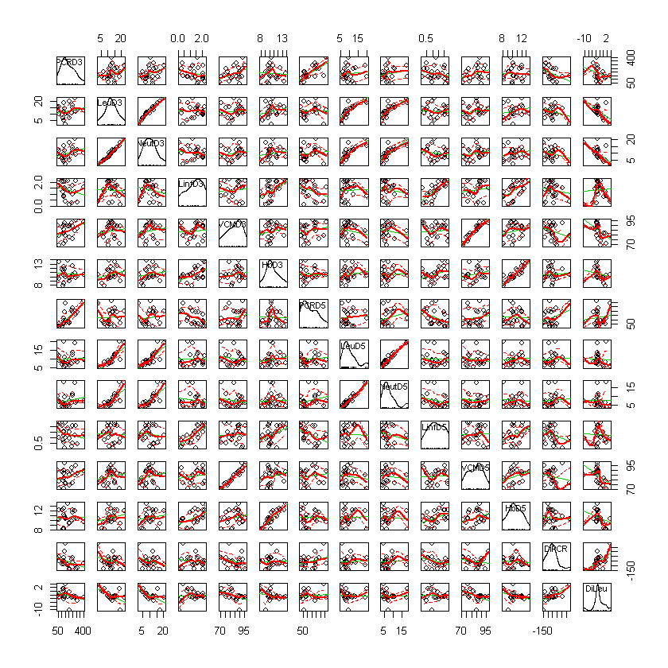
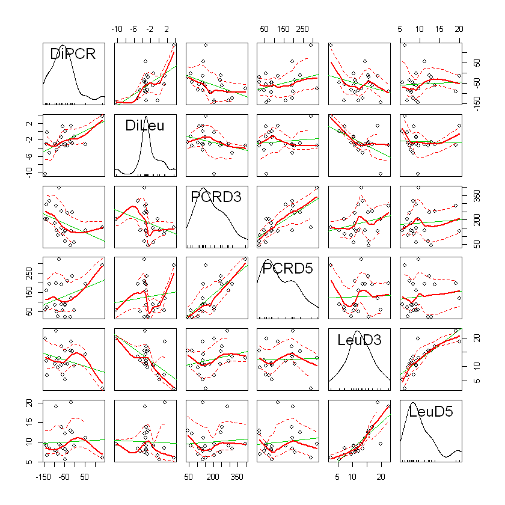
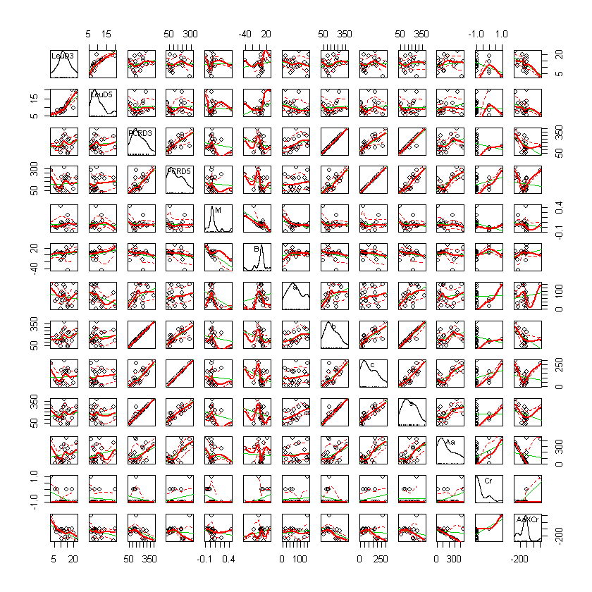
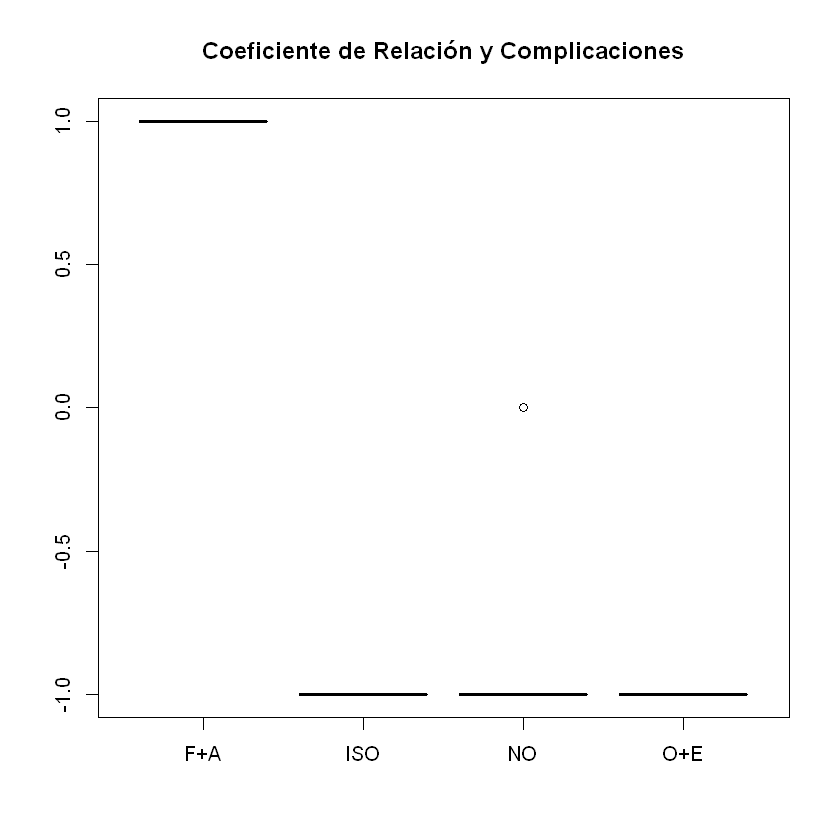
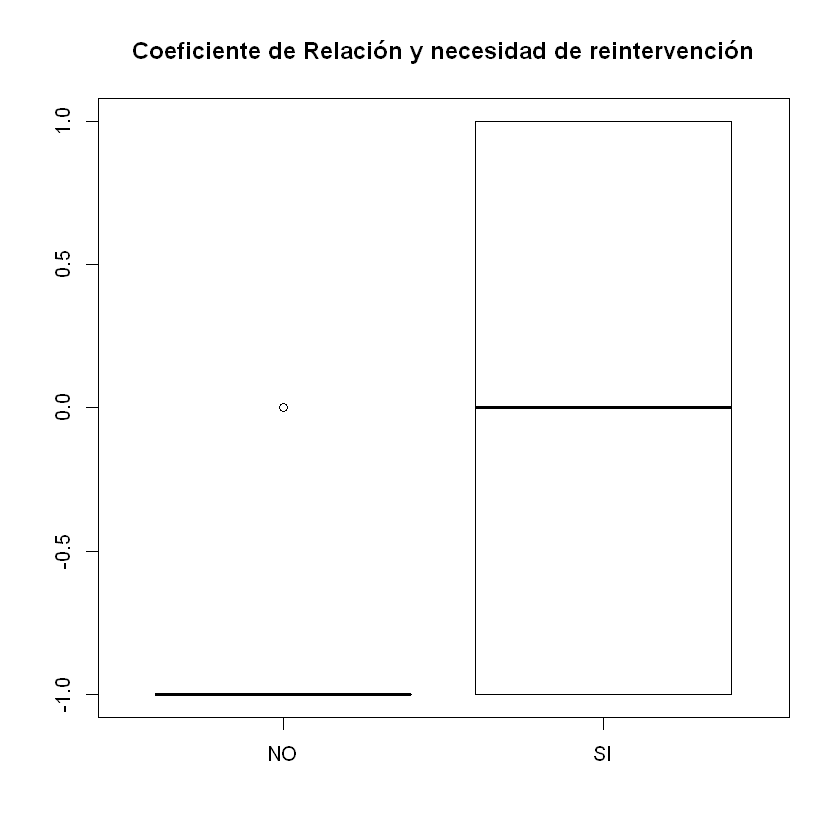
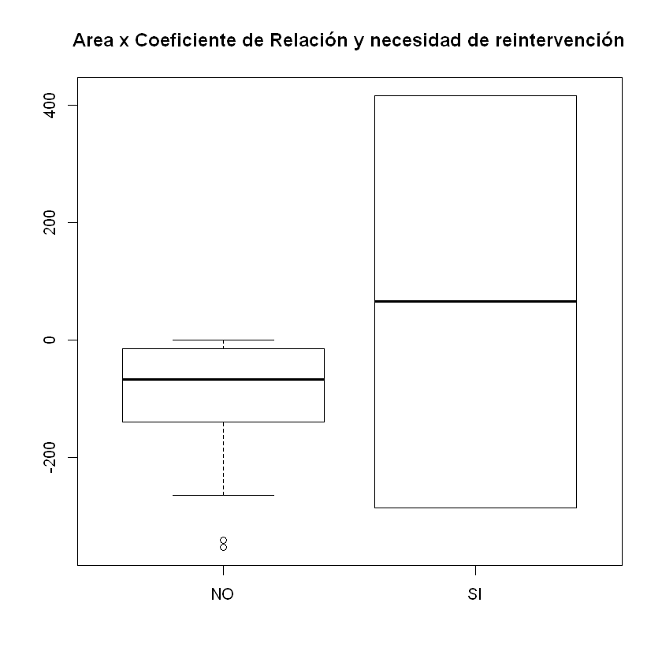

## Metodología

De la población de pacientes en postoperatorio, intervenidos por cirugía gastrointestinal en un centro asistencial de alta complejidad en la ciudad de Pereira, se toma una muestra aleatoria n=22, de quienes se registra la edad, el sexo, el diagnóstico, el tipo de procedimiento, si se realizó abordaje laparoscópico, la presencia de complicaciones, el grado de severidad de la complicación y la necesidad de reintervención en los 5 días posteriores a cirugía, con la meta de comparar estas características con las diferencias entre la medición del valor de la PCR y los valores de hemograma en el dia 3 con respecto al día 5 de cada caso, para estimar el comportamiento de la media y la varianza, teniendo como objetivo proponer un modelo matemático que relacione un valor de referencia estándar para la PCR y las variables del hemograma que muestran un patrón de dependencia con la presencia de complicaciones, con sus grados de severidad y la necesidad de reintervención. 

Usando Jupyter Notebook con el kernel de R, se describe las características de la muestra y se identifica la variable del hemograma que se ajuste linealmente a la PCR; en esta muestra de pacientes, el CAL y el CAN son colineales y muestran un patrón de variación directamente proporcional con la PCR en la mayoría de los casos. 

La tabla general contienen los datos registrados, la tabla descriptiva presenta el sumario estadístico de las variables continuas, posteriormente se presentan los gráficos de dispersión comparativos, con las líneas de regresión y distribuciones explícitas de cada variable, donde se sustenta el sentido de la relación entre la PCR y el CAL.


```R
# Librerías y paquetes utilizadas
install.packages("RcmdrMisc")
install.packages("googlesheets")
install.packages("dplyr")
install.packages("FSA")
library("googlesheets")
library("FSA")
library("psych")
library("gmodels")
library("car")
suppressMessages(library(dplyr))
```


```R
# Conexión a las hojas de calculo de Google
my_sheets <- gs_ls()
gs_ls("CCX")
gap <- gs_title("CCX")
gs_ws_ls(gap)
```


<table>
<thead><tr><th scope=col>sheet_title</th><th scope=col>author</th><th scope=col>perm</th><th scope=col>version</th><th scope=col>updated</th><th scope=col>sheet_key</th><th scope=col>ws_feed</th><th scope=col>alternate</th><th scope=col>self</th><th scope=col>alt_key</th></tr></thead>
<tbody>
	<tr><td>CCX                                                                                                         </td><td>mfm5458                                                                                                     </td><td>rw                                                                                                          </td><td>new                                                                                                         </td><td>2018-11-25 13:51:16                                                                                         </td><td>1QRJOP6m_EQPlsyGK9HvATPns2iqyIW4DH86Y1cEUbuY                                                                </td><td>https://spreadsheets.google.com/feeds/worksheets/1QRJOP6m_EQPlsyGK9HvATPns2iqyIW4DH86Y1cEUbuY/private/full  </td><td>https://docs.google.com/spreadsheets/d/1QRJOP6m_EQPlsyGK9HvATPns2iqyIW4DH86Y1cEUbuY/edit                    </td><td>https://spreadsheets.google.com/feeds/spreadsheets/private/full/1QRJOP6m_EQPlsyGK9HvATPns2iqyIW4DH86Y1cEUbuY</td><td>NA                                                                                                          </td></tr>
</tbody>
</table>


    Sheet successfully identified: "CCX"
    


<ol class=list-inline>
	<li>'Tabla General'</li>
	<li>'Tabla de Cálculos'</li>
</ol>


```R
# Tabla General
gap %>% gs_read(ws = 1)
```

    Accessing worksheet titled 'Tabla General'.
    Parsed with column specification:
    cols(
      .default = col_double(),
      SEXO = col_character(),
      EDAD = col_integer(),
      PROCEDIMIENTO = col_character(),
      DX = col_character(),
      LAPAROSCOPIA = col_character(),
      CCX = col_character(),
      GCCX = col_character(),
      RCX = col_character()
    )
    See spec(...) for full column specifications.
    


<table>
<thead><tr><th scope=col>SEXO</th><th scope=col>EDAD</th><th scope=col>PROCEDIMIENTO</th><th scope=col>DX</th><th scope=col>LAPAROSCOPIA</th><th scope=col>CCX</th><th scope=col>GCCX</th><th scope=col>RCX</th><th scope=col>PCRD3</th><th scope=col>LeuD3</th><th scope=col>...</th><th scope=col>VCMD3</th><th scope=col>HbD3</th><th scope=col>PCRD5</th><th scope=col>LeuD5</th><th scope=col>NeutD5</th><th scope=col>LinfD5</th><th scope=col>VCMD5</th><th scope=col>HbD5</th><th scope=col>DiPCR</th><th scope=col>DiLeu</th></tr></thead>
<tbody>
	<tr><td>M       </td><td>67      </td><td>DI      </td><td>CAc     </td><td>NO      </td><td>NO      </td><td>SC      </td><td>NO      </td><td> 59.92  </td><td>10.30   </td><td>...     </td><td>69.2    </td><td> 9.58   </td><td> 56.96  </td><td> 9.01   </td><td> 6.51   </td><td>0.99    </td><td>71.3    </td><td>10.10   </td><td>  -2.96 </td><td> -1.29  </td></tr>
	<tr><td>M       </td><td>75      </td><td>GT      </td><td>CAg     </td><td>NO      </td><td>NO      </td><td>SC      </td><td>NO      </td><td>136.94  </td><td>14.30   </td><td>...     </td><td>92.9    </td><td>11.80   </td><td>192.04  </td><td>11.10   </td><td> 9.36   </td><td>0.10    </td><td>97.7    </td><td>10.90   </td><td>  55.10 </td><td> -3.20  </td></tr>
	<tr><td>M       </td><td>50      </td><td>DI      </td><td>CAc+E   </td><td>NO      </td><td>O+E     </td><td>MODERADA</td><td>SI      </td><td>241.08  </td><td>10.80   </td><td>...     </td><td>93.0    </td><td> 9.96   </td><td>206.85  </td><td> 7.32   </td><td> 6.29   </td><td>0.28    </td><td>92.7    </td><td> 9.85   </td><td> -34.23 </td><td> -3.48  </td></tr>
	<tr><td>M       </td><td>60      </td><td>GEC     </td><td>CAg     </td><td>NO      </td><td>NO      </td><td>SC      </td><td>NO      </td><td>286.30  </td><td>22.40   </td><td>...     </td><td>84.2    </td><td>10.80   </td><td>195.20  </td><td>19.10   </td><td>17.40   </td><td>1.19    </td><td>85.2    </td><td>12.00   </td><td> -91.10 </td><td> -3.30  </td></tr>
	<tr><td>F       </td><td>58      </td><td>GS      </td><td>CAg     </td><td>NO      </td><td>NO      </td><td>SC      </td><td>NO      </td><td>396.21  </td><td>13.00   </td><td>...     </td><td>93.4    </td><td>10.50   </td><td>319.50  </td><td> 9.56   </td><td> 7.22   </td><td>1.30    </td><td>88.9    </td><td> 9.66   </td><td> -76.71 </td><td> -3.44  </td></tr>
	<tr><td>F       </td><td>53      </td><td>S+CF    </td><td>ED      </td><td>SI      </td><td>NO      </td><td>SC      </td><td>NO      </td><td>104.81  </td><td> 9.57   </td><td>...     </td><td>88.3    </td><td>11.70   </td><td> 23.94  </td><td> 6.86   </td><td> 3.86   </td><td>2.05    </td><td>88.3    </td><td>12.10   </td><td> -80.87 </td><td> -2.71  </td></tr>
	<tr><td>M       </td><td>78      </td><td>DG      </td><td>CAg     </td><td>NO      </td><td>NO      </td><td>SC      </td><td>NO      </td><td>133.32  </td><td>18.70   </td><td>...     </td><td>71.1    </td><td>10.30   </td><td>117.73  </td><td>20.10   </td><td>18.10   </td><td>0.63    </td><td>71.0    </td><td> 8.11   </td><td> -15.59 </td><td>  1.40  </td></tr>
	<tr><td>M       </td><td>67      </td><td>GT+ED+E </td><td>CAg     </td><td>NO      </td><td>NO      </td><td>SC      </td><td>NO      </td><td>203.92  </td><td>19.80   </td><td>...     </td><td>89.8    </td><td> 9.06   </td><td> 59.92  </td><td> 9.54   </td><td> 7.33   </td><td>0.95    </td><td>85.2    </td><td> 9.24   </td><td>-144.00 </td><td>-10.26  </td></tr>
	<tr><td>M       </td><td>53      </td><td>GP      </td><td>GIST    </td><td>NO      </td><td>NO      </td><td>SC      </td><td>NO      </td><td>178.60  </td><td>10.80   </td><td>...     </td><td>89.1    </td><td>13.90   </td><td> 83.75  </td><td> 7.77   </td><td> 4.52   </td><td>1.85    </td><td>88.6    </td><td>13.60   </td><td> -94.85 </td><td> -3.03  </td></tr>
	<tr><td>F       </td><td>65      </td><td>DI      </td><td>CAcx    </td><td>NO      </td><td>NO      </td><td>SC      </td><td>NO      </td><td> 43.71  </td><td>15.50   </td><td>...     </td><td>90.3    </td><td> 9.85   </td><td> 22.88  </td><td>12.90   </td><td> 9.64   </td><td>2.15    </td><td>90.1    </td><td>10.10   </td><td> -20.83 </td><td> -2.60  </td></tr>
	<tr><td>F       </td><td>53      </td><td>GS      </td><td>CAg     </td><td>NO      </td><td>NO      </td><td>SC      </td><td>NO      </td><td>131.41  </td><td>11.10   </td><td>...     </td><td>90.0    </td><td>11.50   </td><td> 84.99  </td><td> 8.09   </td><td> 5.32   </td><td>1.52    </td><td>90.1    </td><td>11.10   </td><td> -46.42 </td><td> -3.01  </td></tr>
	<tr><td>F       </td><td>60      </td><td>S       </td><td>ED      </td><td>NO      </td><td>NO      </td><td>SC      </td><td>NO      </td><td>293.47  </td><td>12.00   </td><td>...     </td><td>96.2    </td><td> 9.64   </td><td>157.78  </td><td> 9.00   </td><td> 6.11   </td><td>2.06    </td><td>94.5    </td><td>10.40   </td><td>-135.69 </td><td> -3.00  </td></tr>
	<tr><td>M       </td><td>66      </td><td>GS      </td><td>CAg     </td><td>SI      </td><td>NO      </td><td>SC      </td><td>NO      </td><td>244.62  </td><td>15.30   </td><td>...     </td><td>76.3    </td><td>10.40   </td><td>232.59  </td><td>12.40   </td><td>11.00   </td><td>0.52    </td><td>76.9    </td><td>11.60   </td><td> -12.03 </td><td> -2.90  </td></tr>
	<tr><td>M       </td><td>57      </td><td>GT      </td><td>CAg     </td><td>NO      </td><td>NO      </td><td>SC      </td><td>NO      </td><td>134.17  </td><td> 5.36   </td><td>...     </td><td>82.2    </td><td> 8.41   </td><td> 88.58  </td><td> 5.48   </td><td> 3.49   </td><td>1.19    </td><td>81.7    </td><td> 8.25   </td><td> -45.59 </td><td>  0.12  </td></tr>
	<tr><td>M       </td><td>62      </td><td>GT      </td><td>CAg     </td><td>NO      </td><td>NO      </td><td>SC      </td><td>NO      </td><td>206.62  </td><td> 6.93   </td><td>...     </td><td>78.0    </td><td> 9.71   </td><td> 71.75  </td><td> 6.64   </td><td> 4.07   </td><td>1.47    </td><td>74.6    </td><td> 9.41   </td><td>-134.87 </td><td> -0.29  </td></tr>
	<tr><td>F       </td><td>63      </td><td>RAR     </td><td>CAr     </td><td>NO      </td><td>NO      </td><td>SC      </td><td>NO      </td><td>134.45  </td><td>12.10   </td><td>...     </td><td>86.4    </td><td>12.30   </td><td> 48.44  </td><td> 7.66   </td><td> 5.02   </td><td>1.56    </td><td>86.5    </td><td>12.50   </td><td> -86.01 </td><td> -4.44  </td></tr>
	<tr><td>F       </td><td>78      </td><td>RAP     </td><td>CAr     </td><td>NO      </td><td>NO      </td><td>SC      </td><td>NO      </td><td>316.41  </td><td>13.40   </td><td>...     </td><td>87.1    </td><td>10.10   </td><td>193.49  </td><td> 8.27   </td><td> 7.18   </td><td>0.45    </td><td>86.8    </td><td>10.30   </td><td>-122.92 </td><td> -5.13  </td></tr>
	<tr><td>F       </td><td>67      </td><td>HCD     </td><td>CAc     </td><td>NO      </td><td>NO      </td><td>SC      </td><td>NO      </td><td>150.45  </td><td>10.40   </td><td>...     </td><td>73.9    </td><td>10.00   </td><td> 87.90  </td><td> 8.97   </td><td> 5.50   </td><td>2.36    </td><td>76.1    </td><td>10.40   </td><td> -62.55 </td><td> -1.43  </td></tr>
	<tr><td>F       </td><td>49      </td><td>GT      </td><td>CAg     </td><td>NO      </td><td>F+A     </td><td>GRAVE   </td><td>SI      </td><td>152.06  </td><td> 2.41   </td><td>...     </td><td>79.5    </td><td>10.40   </td><td>288.32  </td><td> 6.05   </td><td> 4.39   </td><td>0.99    </td><td>76.4    </td><td>10.30   </td><td> 136.26 </td><td>  3.64  </td></tr>
	<tr><td>F       </td><td>54      </td><td>DG      </td><td>CAg     </td><td>NO      </td><td>NO      </td><td>SC      </td><td>NO      </td><td>113.77  </td><td> 7.12   </td><td>...     </td><td>81.6    </td><td> 7.78   </td><td> 57.22  </td><td> 8.41   </td><td> 6.44   </td><td>0.81    </td><td>79.0    </td><td> 8.16   </td><td> -56.55 </td><td>  1.29  </td></tr>
	<tr><td>F       </td><td>56      </td><td>CC      </td><td>CAc     </td><td>NO      </td><td>ISO     </td><td>LEVE    </td><td>NO      </td><td>251.95  </td><td>16.90   </td><td>...     </td><td>89.6    </td><td>12.60   </td><td>189.43  </td><td>13.80   </td><td>10.50   </td><td>2.03    </td><td>86.8    </td><td>12.10   </td><td> -62.52 </td><td> -3.10  </td></tr>
	<tr><td>M       </td><td>67      </td><td>GS      </td><td>CAg     </td><td>NO      </td><td>NO      </td><td>SC      </td><td>NO      </td><td> 68.61  </td><td>15.60   </td><td>...     </td><td>79.1    </td><td>13.40   </td><td> 23.16  </td><td>12.10   </td><td> 7.02   </td><td>2.34    </td><td>78.2    </td><td>12.20   </td><td> -45.45 </td><td> -3.50  </td></tr>
</tbody>
</table>


```R
CCXtg <- gap %>% gs_read(ws = "Tabla General")
```


```R
describe(CCXtg[c(9:22)],
         type=1)
```


<table>
<thead><tr><th></th><th scope=col>vars</th><th scope=col>n</th><th scope=col>mean</th><th scope=col>sd</th><th scope=col>median</th><th scope=col>trimmed</th><th scope=col>mad</th><th scope=col>min</th><th scope=col>max</th><th scope=col>range</th><th scope=col>skew</th><th scope=col>kurtosis</th><th scope=col>se</th></tr></thead>
<tbody>
	<tr><th scope=row>PCRD3</th><td> 1         </td><td>22         </td><td>181.036364 </td><td>90.3793806 </td><td>151.255    </td><td>175.919444 </td><td>80.082639  </td><td>  43.71    </td><td>396.21     </td><td>352.50     </td><td> 0.57975356</td><td>-0.2871839 </td><td>19.2689487 </td></tr>
	<tr><th scope=row>LeuD3</th><td> 2         </td><td>22         </td><td> 12.445000 </td><td> 4.7735649 </td><td> 12.050    </td><td> 12.434444 </td><td> 4.247649  </td><td>   2.41    </td><td> 22.40     </td><td> 19.99     </td><td> 0.03119877</td><td>-0.1703611 </td><td> 1.0177274 </td></tr>
	<tr><th scope=row>NeutD3</th><td> 3         </td><td>22         </td><td> 10.119545 </td><td> 4.5996185 </td><td>  9.790    </td><td>  9.903889 </td><td> 4.069737  </td><td>   1.86    </td><td> 20.70     </td><td> 18.84     </td><td> 0.39158756</td><td>-0.2116967 </td><td> 0.9806420 </td></tr>
	<tr><th scope=row>LinfD3</th><td> 4         </td><td>22         </td><td>  1.340909 </td><td> 0.6684090 </td><td>  1.460    </td><td>  1.378333 </td><td> 0.882147  </td><td>   0.08    </td><td>  2.24     </td><td>  2.16     </td><td>-0.43015876</td><td>-0.9750922 </td><td> 0.1425053 </td></tr>
	<tr><th scope=row>VCMD3</th><td> 5         </td><td>22         </td><td> 84.600000 </td><td> 7.6410545 </td><td> 86.750    </td><td> 85.072222 </td><td> 8.376690  </td><td>  69.20    </td><td> 96.20     </td><td> 27.00     </td><td>-0.47616947</td><td>-0.8245584 </td><td> 1.6290783 </td></tr>
	<tr><th scope=row>HbD3</th><td> 6         </td><td>22         </td><td> 10.622273 </td><td> 1.5235514 </td><td> 10.350    </td><td> 10.566667 </td><td> 1.097124  </td><td>   7.78    </td><td> 13.90     </td><td>  6.12     </td><td> 0.42778186</td><td>-0.2148599 </td><td> 0.3248223 </td></tr>
	<tr><th scope=row>PCRD5</th><td> 7         </td><td>22         </td><td>127.382727 </td><td>87.6192666 </td><td> 88.240    </td><td>119.364444 </td><td>95.909394  </td><td>  22.88    </td><td>319.50     </td><td>296.62     </td><td> 0.63309540</td><td>-0.6721781 </td><td>18.6804904 </td></tr>
	<tr><th scope=row>LeuD5</th><td> 8         </td><td>22         </td><td> 10.005909 </td><td> 3.8202314 </td><td>  8.985    </td><td>  9.411111 </td><td> 2.802114  </td><td>   5.48    </td><td> 20.10     </td><td> 14.62     </td><td> 1.39583152</td><td> 1.3524529 </td><td> 0.8144761 </td></tr>
	<tr><th scope=row>NeutD5</th><td> 9         </td><td>22         </td><td>  7.557727 </td><td> 3.9040625 </td><td>  6.475    </td><td>  6.856667 </td><td> 2.527833  </td><td>   3.49    </td><td> 18.10     </td><td> 14.61     </td><td> 1.59065862</td><td> 1.9110300 </td><td> 0.8323489 </td></tr>
	<tr><th scope=row>LinfD5</th><td>10         </td><td>22         </td><td>  1.308636 </td><td> 0.6861091 </td><td>  1.245    </td><td>  1.317222 </td><td> 0.904386  </td><td>   0.10    </td><td>  2.36     </td><td>  2.26     </td><td>-0.04197772</td><td>-1.1238819 </td><td> 0.1462789 </td></tr>
	<tr><th scope=row>VCMD5</th><td>11         </td><td>22         </td><td> 83.936364 </td><td> 7.5264325 </td><td> 85.850    </td><td> 84.005556 </td><td> 8.228430  </td><td>  71.00    </td><td> 97.70     </td><td> 26.70     </td><td>-0.14542889</td><td>-0.9634291 </td><td> 1.6046408 </td></tr>
	<tr><th scope=row>HbD5</th><td>12         </td><td>22         </td><td> 10.562727 </td><td> 1.4814317 </td><td> 10.350    </td><td> 10.556111 </td><td> 1.519665  </td><td>   8.11    </td><td> 13.60     </td><td>  5.49     </td><td> 0.07554940</td><td>-0.6483924 </td><td> 0.3158423 </td></tr>
	<tr><th scope=row>DiPCR</th><td>13         </td><td>22         </td><td>-53.653636 </td><td>64.4227873 </td><td>-59.535    </td><td>-60.669444 </td><td>49.578144  </td><td>-144.00    </td><td>136.26     </td><td>280.26     </td><td> 1.11012519</td><td> 1.7467873 </td><td>13.7349844 </td></tr>
	<tr><th scope=row>DiLeu</th><td>14         </td><td>22         </td><td> -2.439091 </td><td> 2.7411049 </td><td> -3.005    </td><td> -2.406111 </td><td> 0.719061  </td><td> -10.26    </td><td>  3.64     </td><td> 13.90     </td><td>-0.35244720</td><td> 1.9997223 </td><td> 0.5844055 </td></tr>
</tbody>
</table>


```R
# Gráfico de dispersión de todas las variables continuas
scatterplotMatrix(CCXtg[c(9:22)])
```





```R
scatterplotMatrix(CCXtg[c(21,22,9,15,10,16)])
```





```R
CCXtc <- gap %>% gs_read(ws = "Tabla de Cálculos")
```

    Accessing worksheet titled 'Tabla de Cálculos'.
    Parsed with column specification:
    cols(
      LeuD3 = col_double(),
      LeuD5 = col_double(),
      PCRD3 = col_double(),
      PCRD5 = col_double(),
      LeuC = col_integer(),
      PCRC = col_integer(),
      M = col_double(),
      B = col_double(),
      a = col_double(),
      b = col_double(),
      c = col_double(),
      s = col_double(),
      Aa = col_double(),
      Cr = col_integer(),
      AaXCr = col_double(),
      CCX = col_character(),
      GCCX = col_character(),
      RCX = col_character(),
      pCCX = col_character()
    )
    


```R
describe(CCXtc[c(1:4,7:13,15)],
         type=1)
```


<table>
<thead><tr><th></th><th scope=col>vars</th><th scope=col>n</th><th scope=col>mean</th><th scope=col>sd</th><th scope=col>median</th><th scope=col>trimmed</th><th scope=col>mad</th><th scope=col>min</th><th scope=col>max</th><th scope=col>range</th><th scope=col>skew</th><th scope=col>kurtosis</th><th scope=col>se</th></tr></thead>
<tbody>
	<tr><th scope=row>LeuD3</th><td> 1           </td><td>22           </td><td> 12.44500000 </td><td>  4.773565   </td><td> 12.0500000  </td><td> 12.43444444 </td><td>  4.24764900 </td><td>   2.41000000</td><td> 22.4000000  </td><td> 19.990000   </td><td> 0.03119877  </td><td>-0.1703611   </td><td> 1.01772745  </td></tr>
	<tr><th scope=row>LeuD5</th><td> 2           </td><td>22           </td><td> 10.00590909 </td><td>  3.820231   </td><td>  8.9850000  </td><td>  9.41111111 </td><td>  2.80211400 </td><td>   5.48000000</td><td> 20.1000000  </td><td> 14.620000   </td><td> 1.39583152  </td><td> 1.3524529   </td><td> 0.81447608  </td></tr>
	<tr><th scope=row>PCRD3</th><td> 3           </td><td>22           </td><td>181.03636364 </td><td> 90.379381   </td><td>151.2550000  </td><td>175.91944444 </td><td> 80.08263900 </td><td>  43.71000000</td><td>396.2100000  </td><td>352.500000   </td><td> 0.57975356  </td><td>-0.2871839   </td><td>19.26894869  </td></tr>
	<tr><th scope=row>PCRD5</th><td> 4           </td><td>22           </td><td>127.38272727 </td><td> 87.619267   </td><td> 88.2400000  </td><td>119.36444444 </td><td> 95.90939400 </td><td>  22.88000000</td><td>319.5000000  </td><td>296.620000   </td><td> 0.63309540  </td><td>-0.6721781   </td><td>18.68049040  </td></tr>
	<tr><th scope=row>M</th><td> 5           </td><td>22           </td><td>  0.05938356 </td><td>  0.106372   </td><td>  0.0389792  </td><td>  0.04319117 </td><td>  0.04309499 </td><td>  -0.08980115</td><td>  0.4358108  </td><td>  0.525612   </td><td> 2.16975221  </td><td> 5.5537918   </td><td> 0.02267859  </td></tr>
	<tr><th scope=row>B</th><td> 6           </td><td>22           </td><td>  3.12966573 </td><td> 14.366076   </td><td>  5.3911537  </td><td>  4.18945884 </td><td>  6.65472092 </td><td> -43.66907731</td><td> 30.6722899  </td><td> 74.341367   </td><td>-1.39627157  </td><td> 3.7146870   </td><td> 3.06285765  </td></tr>
	<tr><th scope=row>a</th><td> 7           </td><td>22           </td><td> 71.15665928 </td><td> 43.306554   </td><td> 62.5815761  </td><td> 70.50940845 </td><td> 42.07122661 </td><td>   3.22888526</td><td>144.3650498  </td><td>141.136165   </td><td> 0.26517749  </td><td>-1.0058727   </td><td> 9.23298837  </td></tr>
	<tr><th scope=row>b</th><td> 8           </td><td>22           </td><td>161.38948282 </td><td> 90.166570   </td><td>131.3235573  </td><td>156.19685177 </td><td> 80.42910809 </td><td>  25.93094869</td><td>376.2950493  </td><td>350.364101   </td><td> 0.58813889  </td><td>-0.2888974   </td><td>19.22357739  </td></tr>
	<tr><th scope=row>c</th><td> 9           </td><td>22           </td><td>108.01544704 </td><td> 87.035659   </td><td> 68.2988202  </td><td> 99.79747982 </td><td> 89.26555869 </td><td>   4.35697143</td><td>299.5347118  </td><td>295.177740   </td><td> 0.65042312  </td><td>-0.6662717   </td><td>18.55606484  </td></tr>
	<tr><th scope=row>s</th><td>10           </td><td>22           </td><td>170.28079458 </td><td> 91.768335   </td><td>165.5161822  </td><td>166.96261215 </td><td> 93.55017213 </td><td>  27.66558917</td><td>376.3084272  </td><td>348.642838   </td><td> 0.35465774  </td><td>-0.6029413   </td><td>19.56507466  </td></tr>
	<tr><th scope=row>Aa</th><td>11           </td><td>22           </td><td>158.20714318 </td><td>137.287700   </td><td>111.7571500  </td><td>144.05024167 </td><td>120.56299342 </td><td>  12.47150000</td><td>443.3190000  </td><td>430.847500   </td><td> 0.76768186  </td><td>-0.7212864   </td><td>29.26983591  </td></tr>
	<tr><th scope=row>AaXCr</th><td>12           </td><td>22           </td><td>-85.54680909 </td><td>160.290512   </td><td>-67.2902000  </td><td>-89.18997222 </td><td> 90.51932757 </td><td>-353.17500000</td><td>416.8059000  </td><td>769.980900   </td><td> 0.90722307  </td><td> 2.7863194   </td><td>34.17405204  </td></tr>
</tbody>
</table>


```R
# Gráfico de dispersión de todas las variables continuas
scatterplotMatrix(CCXtc[c(1:4,7:15)])
```

    Warning message in smoother(x, y, col = col[2], log.x = FALSE, log.y = FALSE, spread = spread, :
    "could not fit negative part of the spread"Warning message in smoother(x, y, col = col[2], log.x = FALSE, log.y = FALSE, spread = spread, :
    "could not fit negative part of the spread"Warning message in smoother(x, y, col = col[2], log.x = FALSE, log.y = FALSE, spread = spread, :
    "could not fit negative part of the spread"Warning message in smoother(x, y, col = col[2], log.x = FALSE, log.y = FALSE, spread = spread, :
    "could not fit positive part of the spread"





```R
boxplot(CCXtc$Cr~CCXtc$CCX,
        main="Coeficiente de Relación y Complicaciones")
boxplot(CCXtc$Cr~CCXtc$GCCX,
        main="Coeficiente de Relación y Grado de Complicaciones")
boxplot(CCXtc$Cr~CCXtc$RCX,
        main="Coeficiente de Relación y necesidad de reintervención")
boxplot(CCXtc$AaXCr~CCXtc$CCX,
        main="Area x Coeficiente de Relación y Complicaciones")
boxplot(CCXtc$AaXCr~CCXtc$GCCX,
        main="Area x Coeficiente de Relación y Grado de Complicaciones")
boxplot(CCXtc$AaXCr~CCXtc$RCX,
        main="Area x Coeficiente de Relación y necesidad de reintervención")
```











```R
CrossTable(CCXtc$CCX, CCXtc$pCCX)
CrossTable(CCXtc$CCX, CCXtc$Cr)
CrossTable(CCXtc$GCCX, CCXtc$pCCX)
CrossTable(CCXtc$GCCX, CCXtc$Cr)
```

    
     
       Cell Contents
    |-------------------------|
    |                       N |
    | Chi-square contribution |
    |           N / Row Total |
    |           N / Col Total |
    |         N / Table Total |
    |-------------------------|
    
     
    Total Observations in Table:  22 
    
     
                 | CCXtc$pCCX 
       CCXtc$CCX | INDETERMINADO |      NEGATIVO |      POSITIVO |     Row Total | 
    -------------|---------------|---------------|---------------|---------------|
             F+A |             0 |             0 |             1 |             1 | 
                 |         0.182 |         0.773 |        20.045 |               | 
                 |         0.000 |         0.000 |         1.000 |         0.045 | 
                 |         0.000 |         0.000 |         1.000 |               | 
                 |         0.000 |         0.000 |         0.045 |               | 
    -------------|---------------|---------------|---------------|---------------|
             ISO |             0 |             1 |             0 |             1 | 
                 |         0.182 |         0.067 |         0.045 |               | 
                 |         0.000 |         1.000 |         0.000 |         0.045 | 
                 |         0.000 |         0.059 |         0.000 |               | 
                 |         0.000 |         0.045 |         0.000 |               | 
    -------------|---------------|---------------|---------------|---------------|
              NO |             4 |            15 |             0 |            19 | 
                 |         0.086 |         0.007 |         0.864 |               | 
                 |         0.211 |         0.789 |         0.000 |         0.864 | 
                 |         1.000 |         0.882 |         0.000 |               | 
                 |         0.182 |         0.682 |         0.000 |               | 
    -------------|---------------|---------------|---------------|---------------|
             O+E |             0 |             1 |             0 |             1 | 
                 |         0.182 |         0.067 |         0.045 |               | 
                 |         0.000 |         1.000 |         0.000 |         0.045 | 
                 |         0.000 |         0.059 |         0.000 |               | 
                 |         0.000 |         0.045 |         0.000 |               | 
    -------------|---------------|---------------|---------------|---------------|
    Column Total |             4 |            17 |             1 |            22 | 
                 |         0.182 |         0.773 |         0.045 |               | 
    -------------|---------------|---------------|---------------|---------------|
    
     
    
     
       Cell Contents
    |-------------------------|
    |                       N |
    | Chi-square contribution |
    |           N / Row Total |
    |           N / Col Total |
    |         N / Table Total |
    |-------------------------|
    
     
    Total Observations in Table:  22 
    
     
                 | CCXtc$Cr 
       CCXtc$CCX |        -1 |         0 |         1 | Row Total | 
    -------------|-----------|-----------|-----------|-----------|
             F+A |         0 |         0 |         1 |         1 | 
                 |     0.773 |     0.182 |    20.045 |           | 
                 |     0.000 |     0.000 |     1.000 |     0.045 | 
                 |     0.000 |     0.000 |     1.000 |           | 
                 |     0.000 |     0.000 |     0.045 |           | 
    -------------|-----------|-----------|-----------|-----------|
             ISO |         1 |         0 |         0 |         1 | 
                 |     0.067 |     0.182 |     0.045 |           | 
                 |     1.000 |     0.000 |     0.000 |     0.045 | 
                 |     0.059 |     0.000 |     0.000 |           | 
                 |     0.045 |     0.000 |     0.000 |           | 
    -------------|-----------|-----------|-----------|-----------|
              NO |        15 |         4 |         0 |        19 | 
                 |     0.007 |     0.086 |     0.864 |           | 
                 |     0.789 |     0.211 |     0.000 |     0.864 | 
                 |     0.882 |     1.000 |     0.000 |           | 
                 |     0.682 |     0.182 |     0.000 |           | 
    -------------|-----------|-----------|-----------|-----------|
             O+E |         1 |         0 |         0 |         1 | 
                 |     0.067 |     0.182 |     0.045 |           | 
                 |     1.000 |     0.000 |     0.000 |     0.045 | 
                 |     0.059 |     0.000 |     0.000 |           | 
                 |     0.045 |     0.000 |     0.000 |           | 
    -------------|-----------|-----------|-----------|-----------|
    Column Total |        17 |         4 |         1 |        22 | 
                 |     0.773 |     0.182 |     0.045 |           | 
    -------------|-----------|-----------|-----------|-----------|
    
     
    
     
       Cell Contents
    |-------------------------|
    |                       N |
    | Chi-square contribution |
    |           N / Row Total |
    |           N / Col Total |
    |         N / Table Total |
    |-------------------------|
    
     
    Total Observations in Table:  22 
    
     
                 | CCXtc$pCCX 
      CCXtc$GCCX | INDETERMINADO |      NEGATIVO |      POSITIVO |     Row Total | 
    -------------|---------------|---------------|---------------|---------------|
           GRAVE |             0 |             0 |             1 |             1 | 
                 |         0.182 |         0.773 |        20.045 |               | 
                 |         0.000 |         0.000 |         1.000 |         0.045 | 
                 |         0.000 |         0.000 |         1.000 |               | 
                 |         0.000 |         0.000 |         0.045 |               | 
    -------------|---------------|---------------|---------------|---------------|
            LEVE |             0 |             1 |             0 |             1 | 
                 |         0.182 |         0.067 |         0.045 |               | 
                 |         0.000 |         1.000 |         0.000 |         0.045 | 
                 |         0.000 |         0.059 |         0.000 |               | 
                 |         0.000 |         0.045 |         0.000 |               | 
    -------------|---------------|---------------|---------------|---------------|
        MODERADA |             0 |             1 |             0 |             1 | 
                 |         0.182 |         0.067 |         0.045 |               | 
                 |         0.000 |         1.000 |         0.000 |         0.045 | 
                 |         0.000 |         0.059 |         0.000 |               | 
                 |         0.000 |         0.045 |         0.000 |               | 
    -------------|---------------|---------------|---------------|---------------|
              SC |             4 |            15 |             0 |            19 | 
                 |         0.086 |         0.007 |         0.864 |               | 
                 |         0.211 |         0.789 |         0.000 |         0.864 | 
                 |         1.000 |         0.882 |         0.000 |               | 
                 |         0.182 |         0.682 |         0.000 |               | 
    -------------|---------------|---------------|---------------|---------------|
    Column Total |             4 |            17 |             1 |            22 | 
                 |         0.182 |         0.773 |         0.045 |               | 
    -------------|---------------|---------------|---------------|---------------|
    
     
    
     
       Cell Contents
    |-------------------------|
    |                       N |
    | Chi-square contribution |
    |           N / Row Total |
    |           N / Col Total |
    |         N / Table Total |
    |-------------------------|
    
     
    Total Observations in Table:  22 
    
     
                 | CCXtc$Cr 
      CCXtc$GCCX |        -1 |         0 |         1 | Row Total | 
    -------------|-----------|-----------|-----------|-----------|
           GRAVE |         0 |         0 |         1 |         1 | 
                 |     0.773 |     0.182 |    20.045 |           | 
                 |     0.000 |     0.000 |     1.000 |     0.045 | 
                 |     0.000 |     0.000 |     1.000 |           | 
                 |     0.000 |     0.000 |     0.045 |           | 
    -------------|-----------|-----------|-----------|-----------|
            LEVE |         1 |         0 |         0 |         1 | 
                 |     0.067 |     0.182 |     0.045 |           | 
                 |     1.000 |     0.000 |     0.000 |     0.045 | 
                 |     0.059 |     0.000 |     0.000 |           | 
                 |     0.045 |     0.000 |     0.000 |           | 
    -------------|-----------|-----------|-----------|-----------|
        MODERADA |         1 |         0 |         0 |         1 | 
                 |     0.067 |     0.182 |     0.045 |           | 
                 |     1.000 |     0.000 |     0.000 |     0.045 | 
                 |     0.059 |     0.000 |     0.000 |           | 
                 |     0.045 |     0.000 |     0.000 |           | 
    -------------|-----------|-----------|-----------|-----------|
              SC |        15 |         4 |         0 |        19 | 
                 |     0.007 |     0.086 |     0.864 |           | 
                 |     0.789 |     0.211 |     0.000 |     0.864 | 
                 |     0.882 |     1.000 |     0.000 |           | 
                 |     0.682 |     0.182 |     0.000 |           | 
    -------------|-----------|-----------|-----------|-----------|
    Column Total |        17 |         4 |         1 |        22 | 
                 |     0.773 |     0.182 |     0.045 |           | 
    -------------|-----------|-----------|-----------|-----------|
    
     
    


```R
attach(CCXtc)
tablapCCX <- table(CCXtc$CCX,CCXtc$pCCX)
tablaCr <- table(CCXtc$CCX,CCXtc$Cr)
tablapCCX2 <- table(CCXtc$GCCX,CCXtc$pCCX)
tablaCr2 <- table(CCXtc$GCCX,CCXtc$Cr)
tablapCCX3 <- table(CCXtc$RCX,CCXtc$pCCX)
tablaCr3 <- table(CCXtc$RCX,CCXtc$Cr)
```


```R
tablapCCX <- xtabs(~CCX+pCCX)
summary(tablapCCX)
tablapCCX <- xtabs(~CCX+Cr)
summary(tablaCr)
tablapCCX2 <- xtabs(~GCCX+pCCX)
summary(tablapCCX2)
tablapCCX2 <- xtabs(~GCCX+Cr)
summary(tablaCr2)
tablapCCX3 <- xtabs(~RCX+pCCX)
summary(tablapCCX3)
tablapCCX3 <- xtabs(~RCX+Cr)
summary(tablaCr3)
```


    Call: xtabs(formula = ~CCX + pCCX)
    Number of cases in table: 22 
    Number of factors: 2 
    Test for independence of all factors:
    	Chisq = 22.545, df = 6, p-value = 0.0009642
    	Chi-squared approximation may be incorrect


    Number of cases in table: 22 
    Number of factors: 2 
    Test for independence of all factors:
    	Chisq = 22.545, df = 6, p-value = 0.0009642
    	Chi-squared approximation may be incorrect


    Call: xtabs(formula = ~GCCX + pCCX)
    Number of cases in table: 22 
    Number of factors: 2 
    Test for independence of all factors:
    	Chisq = 22.545, df = 6, p-value = 0.0009642
    	Chi-squared approximation may be incorrect


    Number of cases in table: 22 
    Number of factors: 2 
    Test for independence of all factors:
    	Chisq = 22.545, df = 6, p-value = 0.0009642
    	Chi-squared approximation may be incorrect


    Call: xtabs(formula = ~RCX + pCCX)
    Number of cases in table: 22 
    Number of factors: 2 
    Test for independence of all factors:
    	Chisq = 10.612, df = 2, p-value = 0.004962
    	Chi-squared approximation may be incorrect


    Number of cases in table: 22 
    Number of factors: 2 
    Test for independence of all factors:
    	Chisq = 10.612, df = 2, p-value = 0.004962
    	Chi-squared approximation may be incorrect

